# Airflow-Monitoring-ElasticSearch-LogStash-Kibana

### Project Description:

In this project we look to set up Airflow monitoring using ELK stack. We will set up the stack using 
docker image.Airflow can not write logs directly into ElasticSearch but can read from ElasticSearch. 
Airflow writes data to local in json format and we use file beat installed on worker node
to send data to logstatsh which then transforms the data and then sends 
it to ES.We configure Kibana to connect to our EC2 instance and we will draw dashboards for monitoring our Airflow instance.

### Architecture:

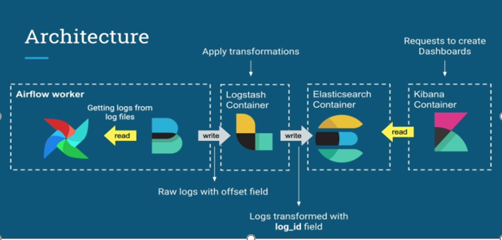

### Setting this project locally 

*Build Docker Image*

Move to the directory where you have cloned this repo locally and bring up the docker image

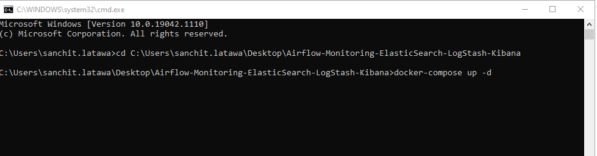

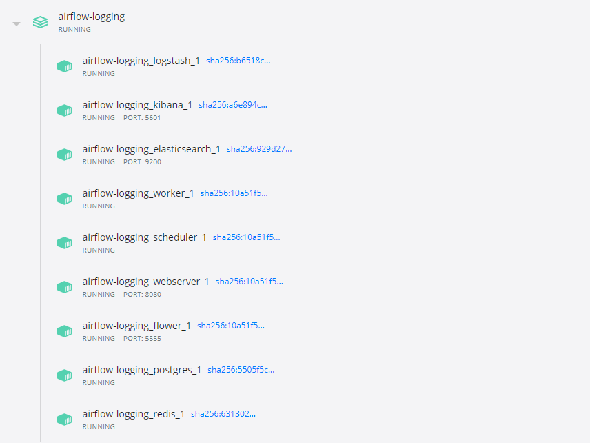

The config changes required to send logs to ES via the discussed architecture are 
there in the `./mnt/airflow/airflow.cfg` file

Once the docker images are running , you should be able to access the following links,
if any issues in accessing the below links check your firewall exceptions settings.

*ElasticSearch*

`http://localhost:9200/`

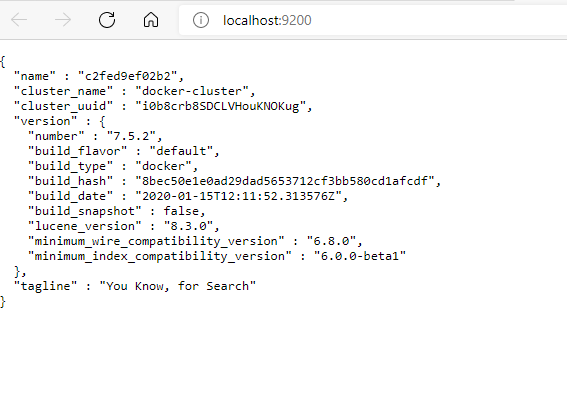

*Kibana*

`http://localhost:5601/`

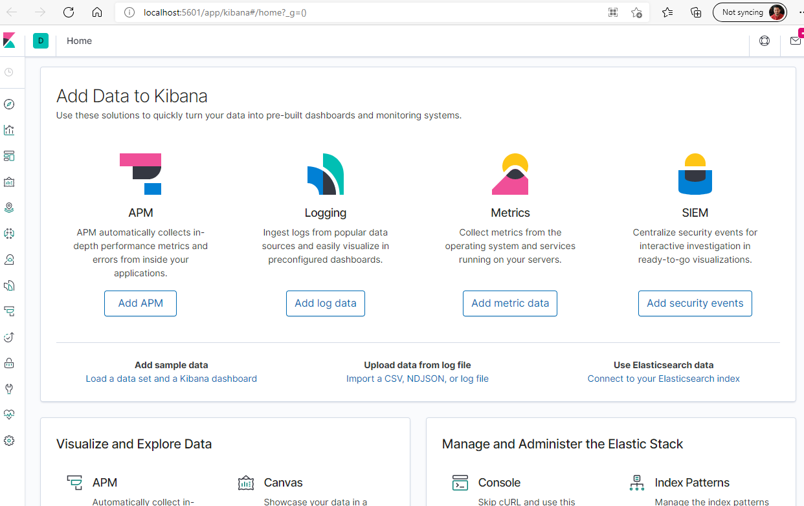

*Airflow*

`http://localhost:8080/`

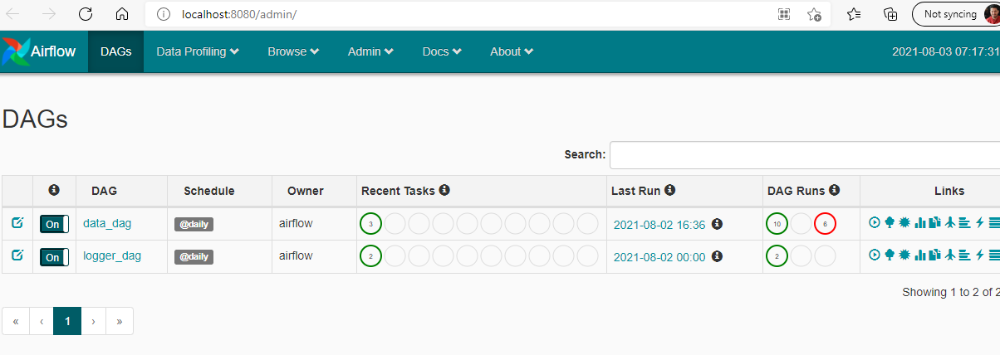

*Install FileBeat*

Open terminal to `airflow worker` and run the below command to download `FileBeat` 

`curl -L -O https://artifacts.elastic.co/downloads/beats/filebeat/filebeat-7.5.2-linux-x86_64.tar.gz`

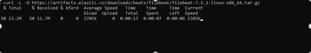

Untar the file

`tar xvzf filebeat-7.5.2-linux-x86_64.tar.gz`

Go into the new created folder `filebeat-7.5.2-linux-x86_64` and place the config file 
placed in this repo at /misc/filebeat.yml into the current folder. The config file has the settings 
to listen to newlog files created by Airfow and send them to Logstash server.

Run the below command to change filebeat.yml permissions 

`chmod go-w ./filebeat.yml`

Start filebeat

`./filebeat`

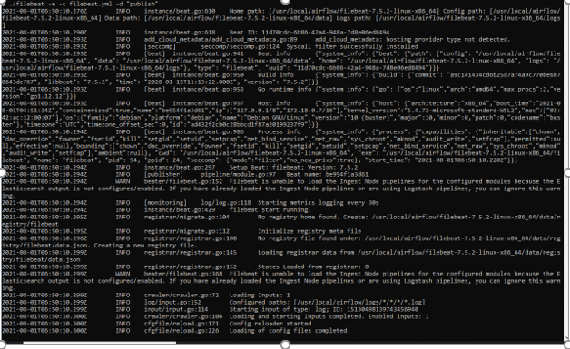

### Creating Dashboards/Reports on Kibana

Before starting this section , run the two dummy dags from the Airflow UI a few times 
so that we have some logs to play around with in Kibana.

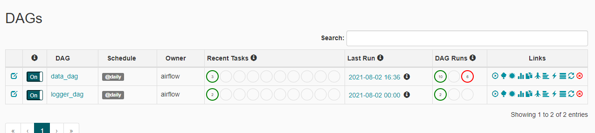

Go to Management from right side navigation pane as shown in the screen shot below

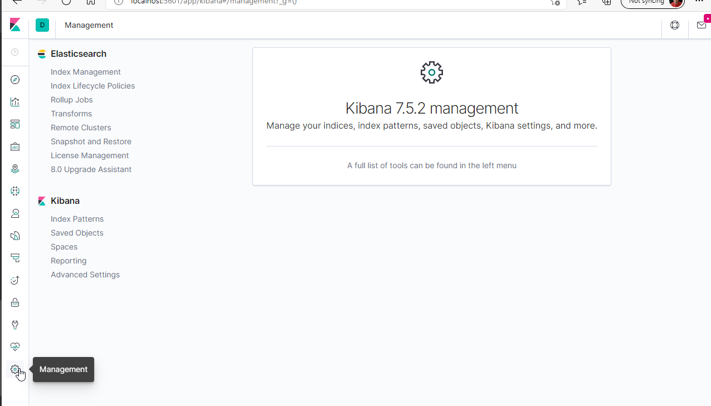

From there select Index Patters -> Create New Index

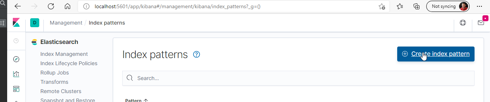

Create a new index on your logs as shown in below screenshots

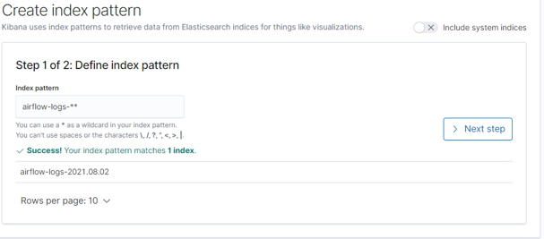

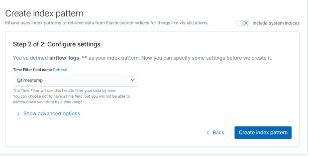

Once created you can see the mappings in the index

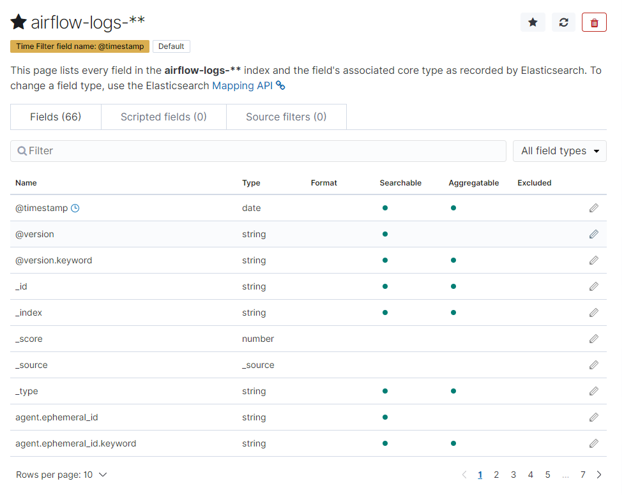

Go to Discover page from left hand side and you can see the log event details

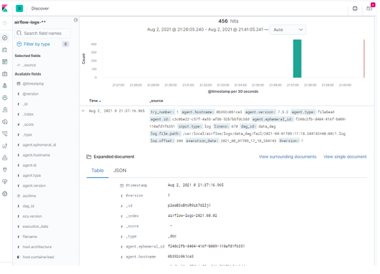

Now that we have index set up let's create a new dashboard which gives us some details 
on tasks health 

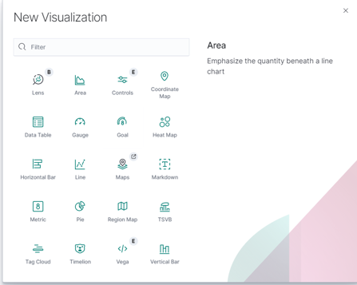

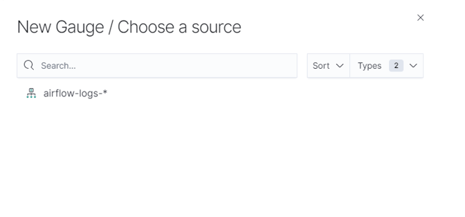

Created a couple of visualizations for seeing task health(tracking `number of failed tasks`)

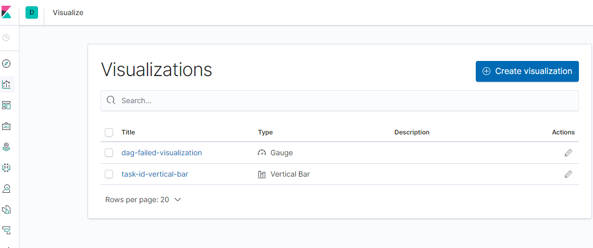

Final DashBoard

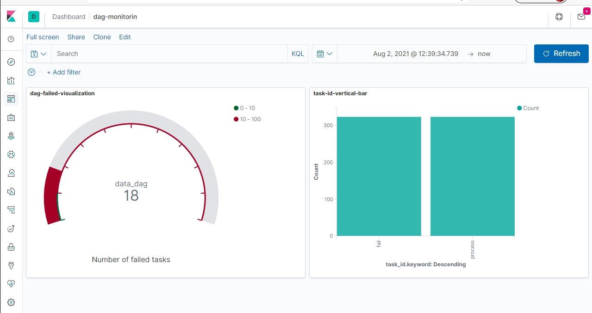
